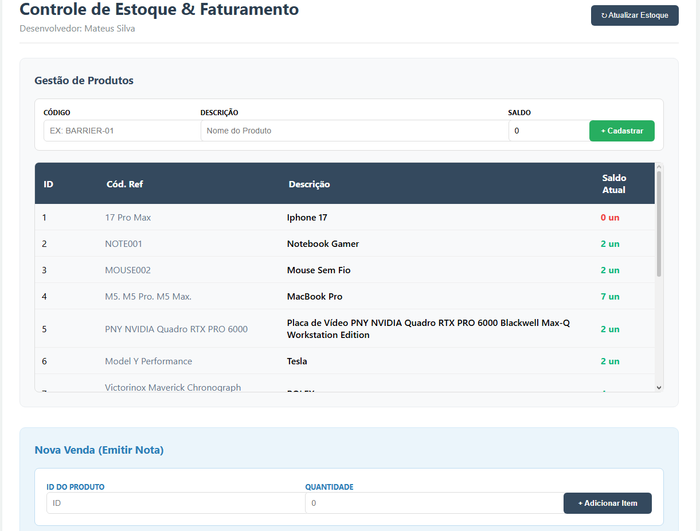

# Sistema de Gestão de Estoque e Faturamento (Desafio Korp)

## 📸 Preview do Sistema

Este projeto é um ecossistema robusto de gestão de estoque e faturamento, estruturado sob a ótica de Microsserviços. O objetivo principal é demonstrar o uso de comunicações síncronas entre serviços, independência de dados e uma interface reativa de alta performance.

Diferenciais Implementados

Validação Cross-Service: O serviço de Faturamento valida o saldo em tempo real consultando o microsserviço de Estoque via HTTP antes de processar qualquer transação.

Programação Defensiva: Implementação de travas em múltiplas camadas (Backend e Frontend) para impedir estados inválidos, como a venda de produtos sem saldo ou emissão de notas vazias.

UX Aprimorada: Interface Single-Page reativa com Angular, indicadores de processamento e sistema de impressão de notas fiscais integrado.

Resiliência: Tratamento de erros global que traduz exceções complexas do backend em alertas claros e amigáveis para o usuário através de Toasts.

## Tecnologias Utilizadas

### **Backend**

Linguagem: C# (.NET 8)

Arquitetura: Clean Architecture, Domain-Driven Design (DDD) e Princípios SOLID.

Banco de Dados: MySQL (Instâncias independentes para garantir o desacoplamento total).

Comunicação: IHttpClientFactory para integração síncrona entre microsserviços.

ORM: Entity Framework Core (Pomelo MySQL)

### **Frontend**

Framework: Angular 17+

Estado e Reatividade: RxJS para gerenciamento de dados e atualizações de componentes sem refresh.

Interface: Design moderno e responsivo com CSS customizado e animações de feedback.

Segurança de UI: Bloqueios dinâmicos de botões baseados no status da nota fiscal.

## Arquitetura do Ecossistema

O sistema é composto por três componentes principais:

Serviço de Estoque: Gerencia o ciclo de vida dos produtos e a integridade do saldo no EstoqueDB.

Serviço de Faturamento: Orquestra a emissão de notas. Regra de Ouro: Nenhuma nota é emitida sem a confirmação de saldo positivo obtida via integração com o serviço de Estoque. Gerencia o FaturamentoDB.

Portal Web (Angular): Interface unificada que consome as APIs, gerenciando estados e feedbacks de processamento.

## ⚙️ Como rodar o projeto

1. Pré-requisitos
SDK do .NET 8.0

Node.js e Angular CLI

MySQL Server

2. Configuração do Backend
 1. Configure as strings de conexão nos arquivos appsettings.json de cada API (Estoque e Faturamento).

 2. Execute as migrações para criar os bancos:

# No serviço de Estoque
dotnet ef database update
# No serviço de Faturamento
dotnet ef database update

 3. No Visual Studio, configure a solução para Múltiplos Projetos de Inicialização (Estoque e Faturamento) e pressione F5.

3. Configuração do Frontend
cd Korp-Web
npm install
ng serve

4. Acesse: http://localhost:4200 no seu navegador de preferência.